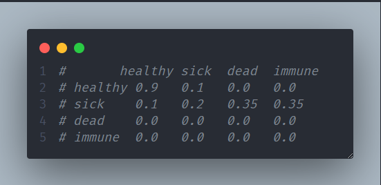
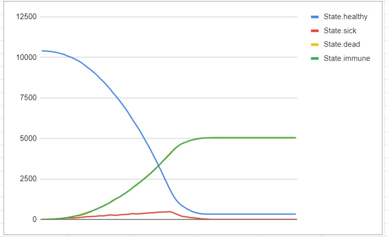

# Código para simulações baseadas em RandonWalk

## Como executar

inicialmente o código conta com 4 estados
- saudável 
- doente
- morto
- imune

e um array de probabilidades de transicao entre cada um desses estados 



</br>
 para rodar o projeto execute 

```
  python3 randomWlakModelMultipleRuns.py 
```

caso queira que o resultado fique disponivel ao fim da execução execute

```
  python3 randomWlakModelMultipleRuns.py output > file.txt
```

pegue esse resultado e faça uso das planilhas disponiveis no projeto para gerar os gráficos de analise com bases nas probabilidades e população definida por você 

## Modificacoes

é possível modificar a quantidade de estados, adicionando ou removendo estados do Enum inicial e ajustando a posição de cada um deles no array de probabilidade de transição de estados.


## Exemplo de resultado 



